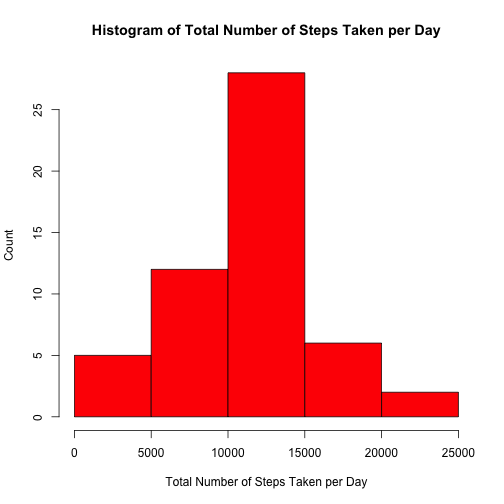
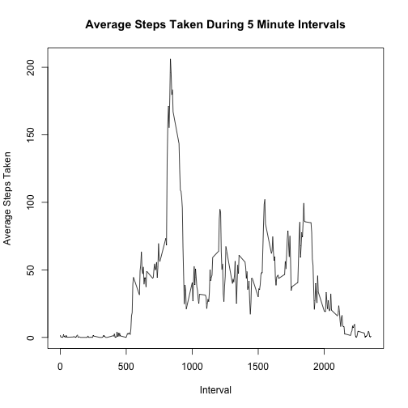
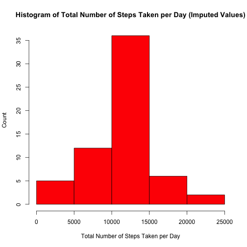
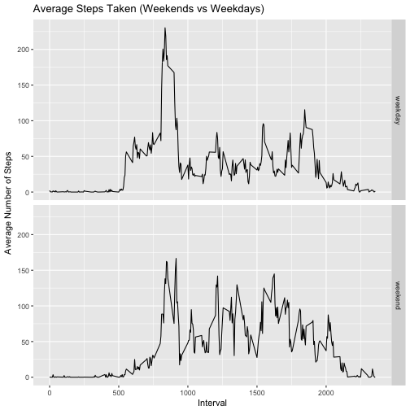

## Loading and preprocessing the data
Load the dplyr and ggplot2 libraries, as these are required for the data
processing.


```r
if(!require(dplyr)){
  install.packages("dplyr")
  library(dplyr)
}
```

```
## Loading required package: dplyr
```

```
## 
## Attaching package: 'dplyr'
```

```
## The following objects are masked from 'package:stats':
## 
##     filter, lag
```

```
## The following objects are masked from 'package:base':
## 
##     intersect, setdiff, setequal, union
```

```r
if(!require(ggplot2)){
  install.packages("ggplot2")
  library(ggplot2)
}
```

```
## Loading required package: ggplot2
```

Load the activity.csv file from the current working directory. If file is not
present, the processing will stop.


```r
if (!file.exists("./activity.csv")) {
  stop(paste("activity.csv does not exist in working directory"))
}
raw_activity_data <- read.csv("./activity.csv", header=TRUE)
```

List the first 5 rows of the raw data:

```r
head(raw_activity_data, n=5)
```

```
##   steps       date interval
## 1    NA 2012-10-01        0
## 2    NA 2012-10-01        5
## 3    NA 2012-10-01       10
## 4    NA 2012-10-01       15
## 5    NA 2012-10-01       20
```

Omit all missing values (as indicated by NA).


```r
processed_activity_data <- na.omit(raw_activity_data)
```

Convert all date strings to date objects


```r
processed_activity_data$date <- as.Date(processed_activity_data$date)
```
## What is mean total number of steps taken per day?
This section of the report will detail the following:

1. Calculate the total number of steps taken per day
2. Create a histogram of the total number of steps taken each day
3. Calculate and report the mean and median of the total number of steps taken per day


```r
# Utilize dplyr to group by day and total up the steps.
steps_per_day <-
  processed_activity_data %>%
  group_by(date) %>%
  summarise(totalsteps=sum(steps))

# Create the histogram using the totalsteps data, with the total
# steps plotted on the x axis.
hist(steps_per_day$totalsteps,
     xlab="Total Number of Steps Taken per Day",
     ylab="Count",
     main="Histogram of Total Number of Steps Taken per Day",
     col=2)
```



```r
# Calculate the mean value of the total steps per day
mean_total_steps_per_day <-
  format(
    mean(steps_per_day$totalsteps), digits = 22, scientific=FALSE)
median_total_steps_per_day <-
  format(
    median(steps_per_day$totalsteps), digits = 22, scientific=FALSE)
```

Mean of total number of steps is **10766.1886792452824011**  
Median of total number of steps is **10765**


## What is the average daily activity pattern?
This section of the report will detail the following:

1. Make a time series plot (i.e type = "l") of the 5-minute interval (x-axis) and the average number of steps taken, averaged across all days (y-axis)
2. Which 5-minute interval, on average across all the days in the dataset, contains the maximum number of steps?


```r
# Use dplyr to group the processed data by intervals and compute
# the average number of steps per interval.
avg_steps_per_interval <-
  processed_activity_data %>%
  group_by(interval) %>%
  summarize(avgsteps=mean(steps))

# Plot the line graph of the average steps taken during intervals
plot(avg_steps_per_interval$interval,
     avg_steps_per_interval$avgsteps,
     type="l",
     xlab="Interval",
     ylab="Average Steps Taken",
     main="Average Steps Taken During 5 Minute Intervals")
```



```r
# Determine at which interval has the highest number of steps
max_steps_interval <-
  avg_steps_per_interval$interval[
    which.max(avg_steps_per_interval$avgsteps)]
```

The 5-minute interval that contains the maximum number of steps (on average across all the days in the dataset) is **835**


## Imputing missing values
This section of the report will detail the following:

1. Calculate and report the total number of missing values in the dataset (i.e the total number of rows with NAs)
2. Devise a strategy for filling in all of the missing values in the dataset. The strategy does not need to be sophisticated. For example, you could use the mean/median for that day, or the mean for that 5-minute interval, etc.
3. Create a new dataset that is equal to the original dataset but with the missing data filled in.
4. Make a histogram of the total number of steps taken each day and Calculate and report the mean and median total number of steps taken per day. Do these values differ from the estimates from the first part of the assignment? What is the impact of imputing missing data on the estimates of the total daily number of steps?

```r
# What is the number of missing values we are dealing with
missing_values <- sum(is.na(raw_activity_data))
```
The total number of missing values in the raw data set is **2304**

In order to impute a missing value for a given interval, the average number of steps during that particular interval (averaged over all days) will be used.


```r
# Create a new data frame using the raw data that will have
# missing values imputed. Convert the date strings to date objects
imputed_activity_data <- raw_activity_data
imputed_activity_data$date <- as.Date(imputed_activity_data$date)

# Loop through each row and replace a NA with the average number
# of steps during that 5 minute interval over all days. Use the
# avg_steps_per_interval data frame that was computed earlier
for (idx in 1:nrow(imputed_activity_data)) {
  if (is.na(imputed_activity_data$steps[idx])) {
    # Determine the row in the average steps per interval that
    # matches the interval with the missing steps data.
    idx2 <-
      which(imputed_activity_data$interval[idx] ==
              avg_steps_per_interval$interval)
    # Take the average steps for that given interval and impute
    # the missing steps data.
    imputed_activity_data$steps[idx] <-
      avg_steps_per_interval[idx2,]$avgsteps
  }
}

# Utilize dplyr to group by day and total up the steps.
imputed_steps_per_day <-
  imputed_activity_data %>%
  group_by(date) %>%
  summarise(totalsteps=sum(steps))

# Create the histogram using the totalsteps data, with the total
# steps plotted on the x axis.
hist(imputed_steps_per_day$totalsteps,
     xlab="Total Number of Steps Taken per Day",
     ylab="Count",
     main="Histogram of Total Number of Steps Taken per Day (Imputed Values)",
     col=2)
```



```r
# Calculate the mean value of the total steps per day
imputed_mean_total_steps_per_day <-
  format(
    mean(imputed_steps_per_day$totalsteps),
    digits = 22,
    scientific = FALSE)
imputed_median_total_steps_per_day <-
  format(
    median(imputed_steps_per_day$totalsteps),
      digits = 22,
      scientific = FALSE)
```
Mean of total number of steps is **10766.1886792452824011**  
Median of total number of steps is **10766.1886792452824011**

The following table compares the non-imputed mean and median values with the imputed mean and media values:

| | Non-imputed | Imputed |
|--|-----------|--------------|
|Mean| 10766.1886792452824011 | 10766.1886792452824011 |
|Median | 10765 | 10766.1886792452824011  |

The mean value for the imputed data **is the same** as the non-imputed data. The median value for the imputed data **has increased slightly** to where it is now **equal** to the mean value. The effects of imputing the missing data with mean values left the mean unchanged but slightly changed the median value.


## Are there differences in activity patterns between weekdays and weekends?
This section of the report will detail the following:

1. Create a new factor variable in the dataset with two levels - "weekday" and "weekend" indicating whether a given date is a weekday or weekend day.
2. Make a panel plot containing a time series plot (i.e type = "l") of the 5-minute interval (x-axis) and the average number of steps taken, averaged across all weekday days or weekend days (y-axis).

Add a day_of_week factor to the imputted data frame by using the weekdays() function. This will result in a new 'day_of_week' column with one of the following values: 'Monday','Tuesday','Wednesday','Thursday','Friday','Saturday','Sunday'. This is an interim step in determining if a given date falls on a weekend (Saturday or Sunday) or a weekday (all the other days).


```r
# Use the weekdays method to add the new factor variable to the 
# imputted data set that was worked with earlier.
imputed_activity_data$day_of_week <-
  weekdays(imputed_activity_data$date)
```

A random sampling of rows shows the newly added factor

```r
# List a few random rows to illustrate the new factor
print(imputed_activity_data[sample(nrow(imputed_activity_data), 10),])
```

```
##             steps       date interval day_of_week
## 12383   0.0000000 2012-11-12     2350      Monday
## 7242    0.0000000 2012-10-26      325      Friday
## 11621 171.1509434 2012-11-10      820    Saturday
## 16916  11.0000000 2012-11-28     1735   Wednesday
## 2829    0.0000000 2012-10-10     1940   Wednesday
## 10148   0.0000000 2012-11-05      535      Monday
## 1474    0.0000000 2012-10-06      245    Saturday
## 12702   0.1320755 2012-11-14      225   Wednesday
## 356     0.0000000 2012-10-02      535     Tuesday
## 16807   0.0000000 2012-11-28      830   Wednesday
```

Now that the day_of_week factor is in place, add a new factor day_of_week_type that will be equal to 'weekend' if the day_of_week value is either 'Saturday' or 'Sunday' or 'weekday' for all other values.

```r
# If the day of week is Saturday or Sunday, mark row as weekend.
# Otherwise, mark as weekday.
imputed_activity_data$day_of_week_type <- ifelse(imputed_activity_data$day_of_week %in% c('Saturday','Sunday'), "weekend", "weekday")
```
A random sampling of rows show the newly added factor

```r
# List a few random rows to illustrate the new factor
print(imputed_activity_data[sample(nrow(imputed_activity_data), 10),])
```

```
##          steps       date interval day_of_week day_of_week_type
## 5623   49.0000 2012-10-20     1230    Saturday          weekend
## 15840   0.0000 2012-11-24     2355    Saturday          weekend
## 5970   48.0000 2012-10-21     1725      Sunday          weekend
## 1721    0.0000 2012-10-06     2320    Saturday          weekend
## 12774 155.3962 2012-11-14      825   Wednesday          weekday
## 3338   20.0000 2012-10-12     1405      Friday          weekday
## 17381 171.1509 2012-11-30      820      Friday          weekday
## 15224   0.0000 2012-11-22     2035    Thursday          weekday
## 2044    0.0000 2012-10-08      215      Monday          weekday
## 4496    0.0000 2012-10-16     1435     Tuesday          weekday
```
Group the data by day_of_week_type and interval in order to compute the average number of steps for the weekdays and weekends.

```r
# Use dplyr to group the data by the day_of_week_type and 
# intervals and compute the average number of steps
day_of_week_type_avg <-
  imputed_activity_data %>%
  group_by(day_of_week_type, interval) %>%
  summarize(avgsteps=mean(steps))
```
Plot the average number of steps for weekdays and weekends

```r
# Create the panel plot
qplot(interval, avgsteps, data=day_of_week_type_avg,
      geom="line",
      xlab="Interval",
      ylab="Average Number of Steps",
      main="Average Steps Taken (Weekends vs Weekdays)",
      facets = day_of_week_type ~ .)
```



These plots illustrate that increased activity starts earlier during the weekdays as compared to the weekends.
